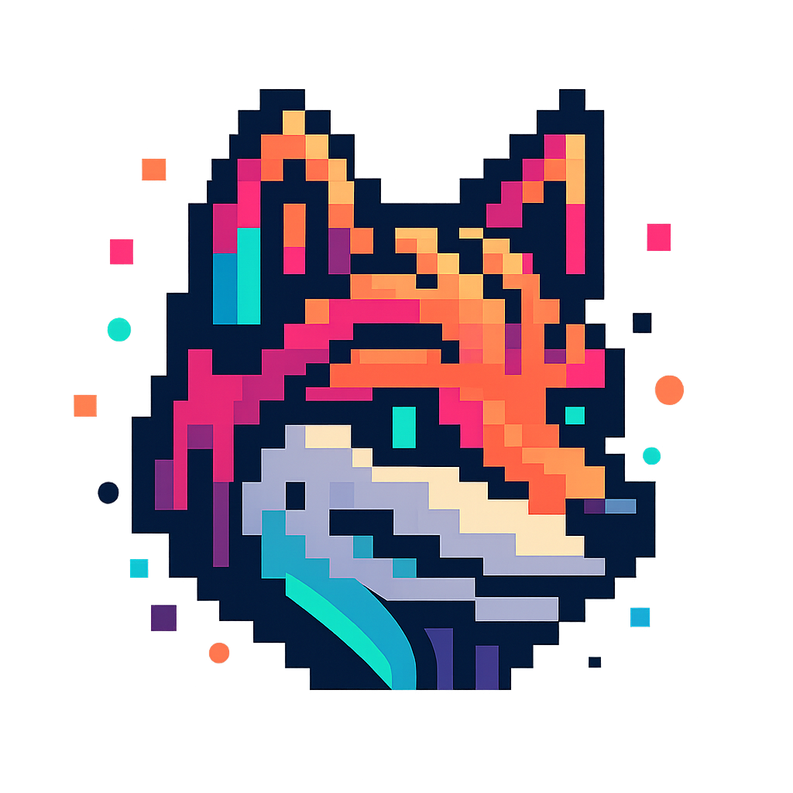

# Cyfox - Desktop DevOps Buddy

<p align="center">
  
</p>

Animated desktop buddy for Raspberry Pi Zero 2W with Argon40 Pod Display. Reminds you to eat/drink/rest, scans your network, and shows Reddit posts.

## Quick Start

```bash
# Install dependencies
pip install -r requirements.txt

# Run
python run.py
```

## Features

- **Reminders**: Eat, drink, rest, focus alerts
- **Network Scanner**: Port scanning and vulnerability detection
- **Reddit**: IT/DevOps posts from ProgrammerHumor, sysadmin, devops, linuxmemes
- **Animations**: Sprite-based animations with button controls

## Button Controls

- **Button 1**: Acknowledge reminder
- **Button 2**: Next Reddit post
- **Button 3**: Start network scan
- **Button 4**: Cycle modes (Buddy → Scanner → Reddit)

## Installation

### Local
```bash
pip install -r requirements.txt
python run.py
```

### Docker
```bash
docker build -t cyfox:latest .
docker run --privileged --network host --pid host \
  -v /dev:/dev -v /sys:/sys cyfox:latest
```

### k3s
```bash
kubectl apply -f k8s/
```

## Configuration

Edit `config/config.yaml`:
- Reminder intervals (minutes)
- Network scanner settings
- Reddit subreddits
- Button GPIO pins
- Animation settings

## Project Structure

```
src/
├── core/        # State & config management
├── display/     # Display handling
├── animation/   # Sprite animations
├── buttons/     # GPIO button handler
└── modules/     # Reminder, scanner, reddit
```

## Troubleshooting

**Display not working?**
```bash
curl https://download.argon40.com/podsystem.sh | bash
```

**Buttons not working?**
```bash
sudo usermod -a -G gpio $USER
# Logout and login
```

## Creating Sprites

See `SPRITE_GUIDE.md` for creating sprite sheets from your `cyfox.png`.

## License

MIT
